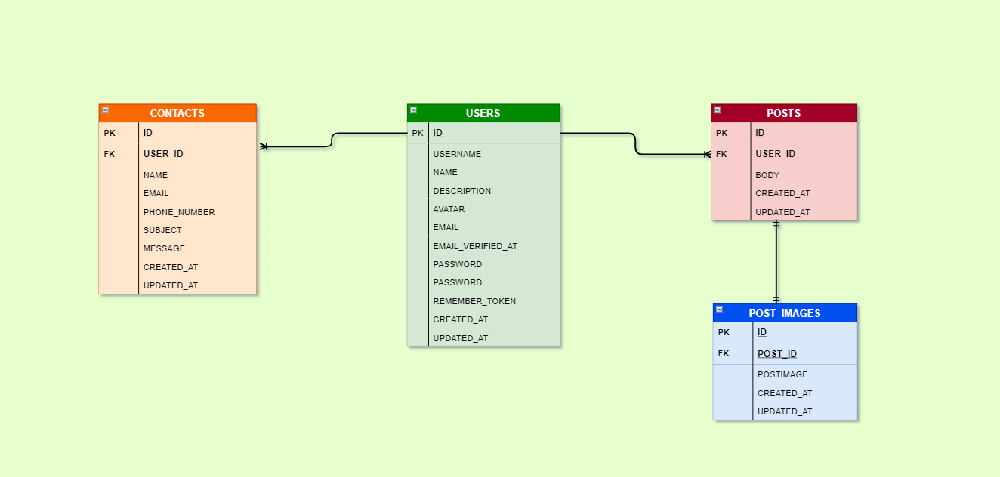
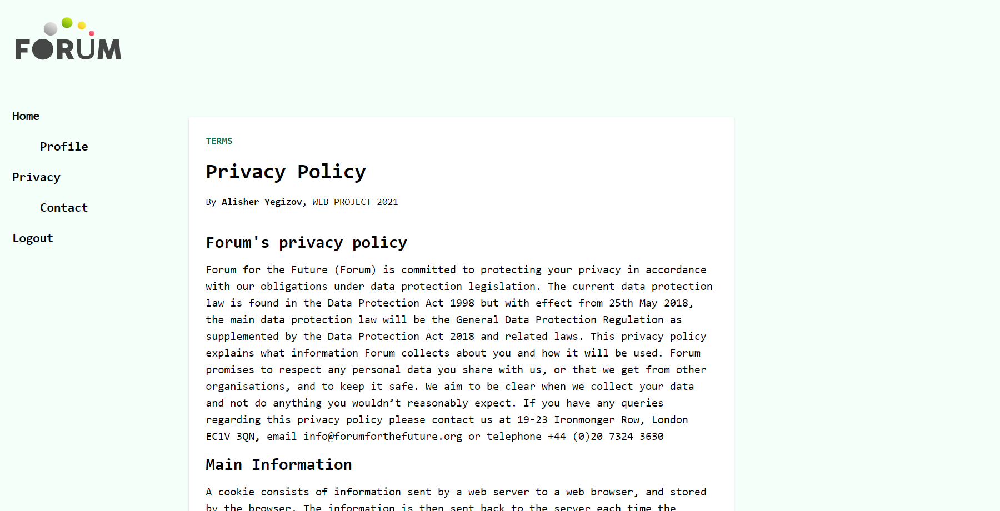

## About Project

This is my project about FORUM, where people can log in to application and then they can start to share information
between each other, speak by typing and talk about interesting topics.
It's is like Clubhouse, but without audio.
This is very useful application, where people can get close to each other, and upgrade communication skills!

## My DATABASE
My database consist of four tables: USERS table; POSTS table; POST_IMAGES table; CONTACTS table;

### USERS table:
USERS table has information about authorized users, and contain informations like id, name, username(short form of name), 
email, description about user, password and user profile image.

### POSTS table:
POSTS table contain user's posts. Table has attrubutes like body(post of user),id and user_id which is foreign key of 
the table.

### POST_IMAGES table:
 POST_IMAGES table contain user posted files, like gif,jpg and PNG. Table's attributes are id, post_id(foreign key) and
 postImage.

### CONTACTS table:
 CONTACTS table contain messages of users to Administration of the Forum. Table has id, user_id(foreign key), name, email,phone_number, subject and message attributes.

## DATABASE ERD
  This is entity relationship diagram of my database.
  My database has one to many relationship between USERS and POSTS tables, also between USERS and CONTACTS tables.
  It has one to one relationship between POSTS and POST_IMAGES tables
   

## Pages of the Forum

### Register page

### Login page

### Home page

### Profile page

### Privacy page

### Contact page

## About my application in detail
My application has several features

### User can edit your profile

### User can't edit profile of another user

### User's posts will be shown in profile page, after posting it

### User can reset password by sending email

### User can email to admin by contact form

